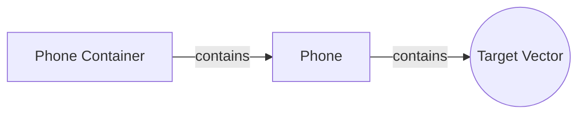

# Gyroscopic Background Images
This is a javascript library that uses the WebVR API to create web backgrounds that move with your phone. I have a vision for it to be the next "parallax" of the web. Feel free to contribute!

** Currently only supported on WebVR capable devices **


## Usage

```
//new GyroBackground( containerEl, imageURL, options )

var background = new GyroBackground('#myImage', 'imgs/4.jpg', {
  sensitivity: 3,
  parallax: true,
  parallaxSpeed: -4
});
```

|    Option   |  Type  | Default Value | Description |
|      --     |   --   |      --       |      --     |
| parallax | Boolean | false | Enable parallax on devices that don't have WebVR support. |
| parallaxSpeed | Float | -2 | How slow/fast the image moves while scrolling |
| sensitivity | Float | 0.5 | The "image's" responsiveness to movement. |
| landscapeSensitivity | Float | sensitivity | The "image's" responsiveness to movement when the device is in landscape mode. |
| portraitSensitivity | Float | sensitivity | The "image's" responsiveness to movement when the device is in portrait mode. |
| zoom | int | 0 | This value is added to the camera's z-distance from the image. |
| landscapeZoom | int | 0 | This value is added to the camera's z-distance when the device is in landscape mode. |
| portraitZoom | int | 0 | This value is added to the camera's z-distance when the device is in portrait mode. |
| offsetX | int | 0 | The image's offset from the auto-calculated X position. |
| portraitOffsetX | int | offsetX | The image's offset from the auto-calculated X position when the device is in portrait mode. |
| landscapeOffsetX | int | offsetX | The image's offset from the auto-calculated X position when the device is in landscape mode. |
| offsetY | int | 0 | The image's offset from the auto-calculated Y position. |
| portraitOffsetY | int | offsetY | The image's offset from the auto-calculated Y position when the device is in portrait mode. |
| landscapeOffsetY | int | offsetY | The image's offset from the auto-calculated Y position when the device is in landscape mode. |
| inverted | Boolean | false | Reverse movement on the X & Y axis. |


## How it works


